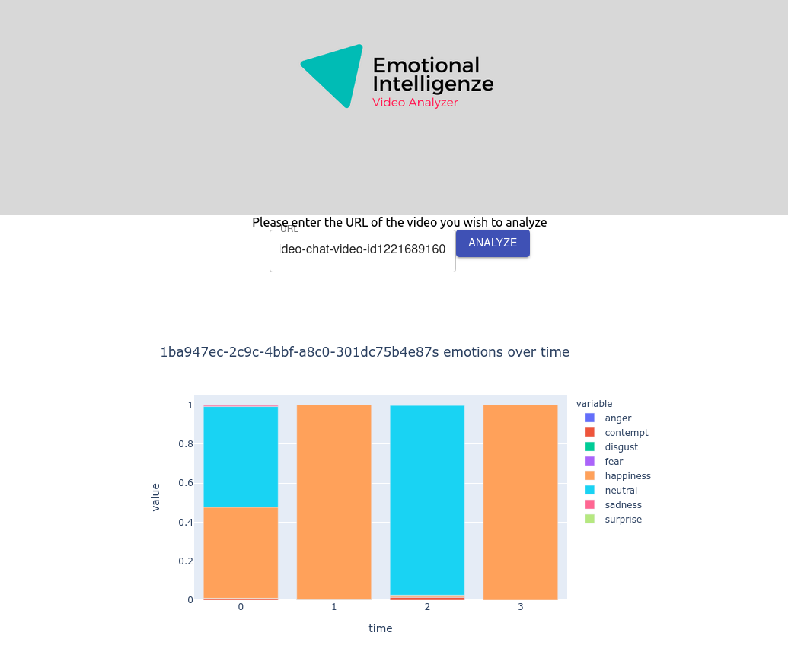

# Emotional Intelligenze app
Analyze your video conferences by submitting a link to them on this app! Gain insights into video participants' emotions
during the meeting.

## Set up
Ensure that the backend of the app is running before starting the front end server.

1. Clone the repo
2. `cd frontend`
3. `yarn install`
4. `yarn start`

## How it works
Firstly, enter a URL for a video that is hosted online. (e.g. Zoom Cloud). Click the analyze button and wait for the results.

A image will pop up in your browser indicating the IDs assigned to each person in the meeting. This ID can be used to identiy their individual emotions.

For example, we analyzed [this](https://media.istockphoto.com/videos/group-of-six-friends-saying-cheers-over-video-chat-video-id1221689160) video and got this result.

